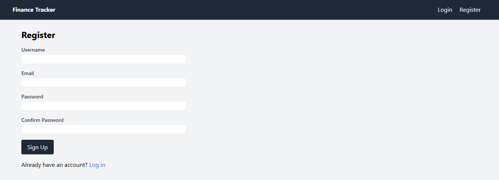
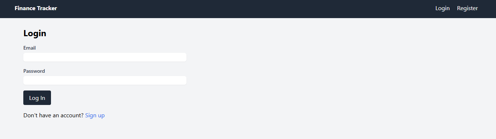
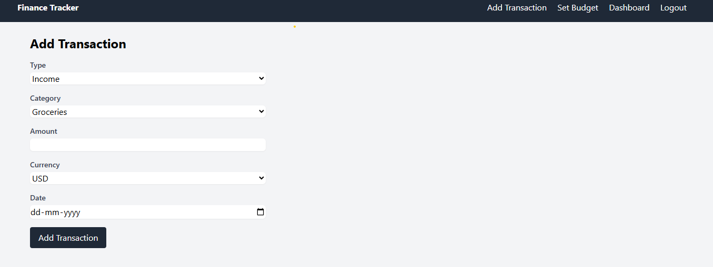
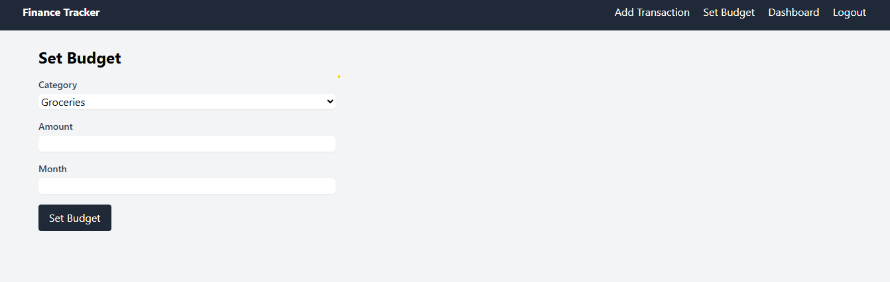
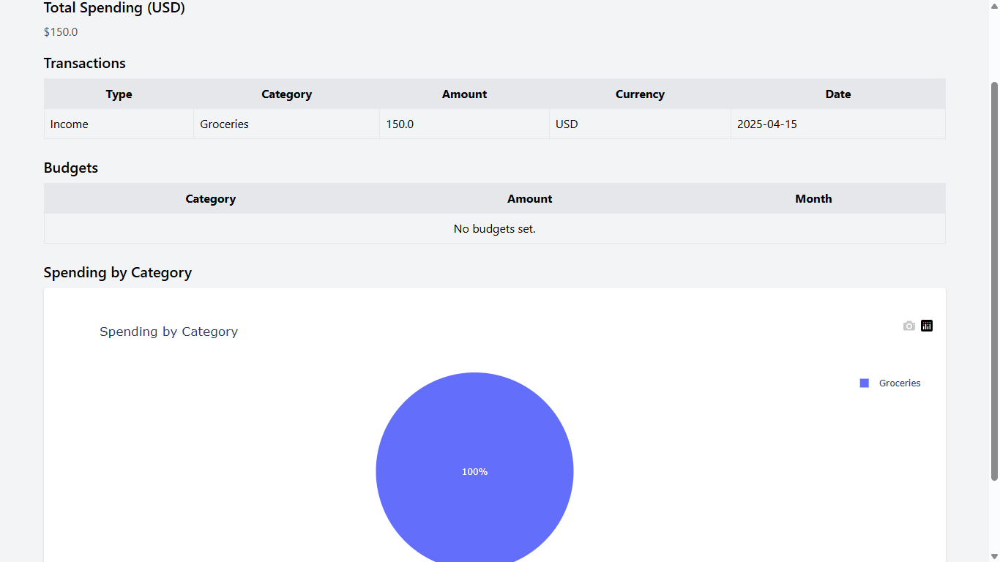

# Personal Finance Tracker

A Flask-based web application designed to help users manage their personal finances with ease. Users can register, log in, track income and expenses, set budgets, and visualize spending patterns with interactive charts. The app integrates real-time currency conversion using ExchangeRate-API and is deployed on Render for public access, making it a robust, user-friendly tool for financial management.

## Live URL: (https://personal-finance-tracker-94v0.onrender.com)

## Features

- **User Authentication**: Secure registration and login system to manage personalized financial data.
- **Transaction Management**: Log income and expenses with categories, amounts, currencies, and dates.
- **Budget Planning**: Set monthly budgets for specific categories to track spending goals.
- **Real-Time Currency Conversion**: Convert transaction amounts to USD using ExchangeRate-API with caching for efficiency.
- **Interactive Visualizations**: View spending by category with Plotly pie charts.
- **Cache Management**: Clear cached exchange rates to fetch fresh data.
- **Responsive Design**: Mobile-friendly UI styled with Tailwind CSS.
- **Security**: CSRF protection, password hashing with Bcrypt, and comprehensive logging.
- **Health Check**: Endpoint to monitor application status.

## Screenshots

Below are screenshots showcasing the main features of the Personal Finance Tracker:

### Registration Page

Register a new account with a username, email, and password.

### Login Page

Log in with your email and password to access your financial data.

### Add Transaction

Log income or expenses with details like category, amount, and currency.

### Set Budget

Set monthly budgets for specific categories to manage spending.

### Dashboard

View transactions, budgets, total spending in USD, and a spending breakdown chart.

